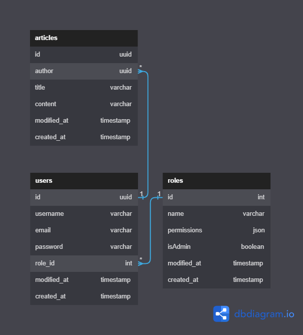

# Bob database description

## Users

### Table storage data about users

| Column      | Type             | Default             | Is null | Description                                           |
| ----------- | ---------------- | ------------------- | ------- | ----------------------------------------------------- |
| id          | uuid primary key | `gen_random_uuid()` | False   | user id                                               |
| username    | varchar          | -                   | False   | Name of the user                                      |
| email       | varchar          | -                   | False   | Email of the user                                     |
| password    | varchar          | -                   | False   | Password of the user (encrypted using sha256 or hash) |
| role_id     | int              | -                   | False   | Role id relation with [Roles](#Roles)                 |
| modified_at | timestamp        | `now()`             | False   | When last modified                                    |
| created_at  | timestamp        | `now()`             | False   | When created                                          |

## Roles

### Table storage data about available roles for users

| Column      | Type            | Default | Is null | Description        |
| ----------- | --------------- | ------- | ------- | ------------------ |
| id          | int primary key |         | False   | role id            |
| name        | varchar         | -       | False   | Name of the role   |
| permissions | varchar/json    | -       | False   | Role permissions   |
| isAdmin     | boolean         | -       | False   | If admin           |
| modified_at | timestamp       | `now()` | False   | When last modified |
| created_at  | timestamp       | `now()` | False   | When created       |

## Articles

### Table storage data about articles

| Column      | Type             | Default             | Is null | Description                                             |
| ----------- | ---------------- | ------------------- | ------- | ------------------------------------------------------- |
| id          | uuid primary key | `gen_random_uuid()` | False   | user id                                                 |
| author      | uuid             | -                   | False   | Author id of the articles relation with [Users](#Users) |
| title       | varchar          | -                   | False   | Title of the articles                                   |
| content     | varchar          | -                   | False   | Content of the articles                                 |
| modified_at | timestamp        | `now()`             | False   | When last modified                                      |
| created_at  | timestamp        | `now()`             | False   | When created                                            |
